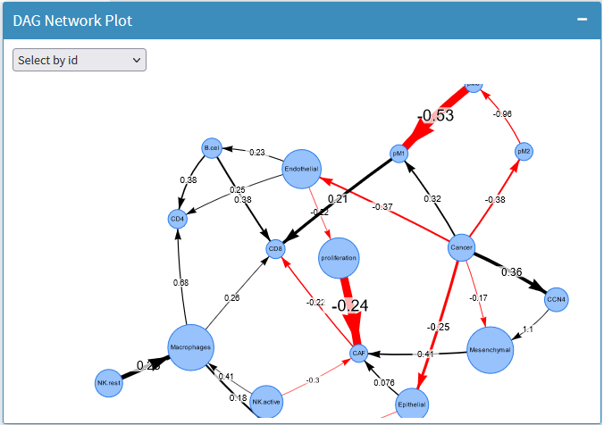
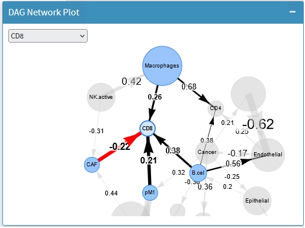
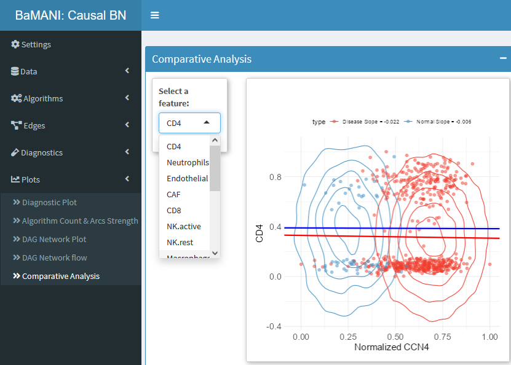

# Bayesian-Multi-Algorithm-Causal-Network-Inference

BaMANI: Bayesian Multi-Algorithm Causal Network Inference
Introduction
BaMANI (Bayesian Multi-Algorithm Causal Network Inference) is an advanced software tool designed for Bayesian network inference. It leverages a variety of algorithms and incorporates user-defined constraints to improve the accuracy of inferring structure and causality within networks from observational data. BaMANI is invaluable for researchers and practitioners across domains such as biology, medicine, and social sciences, where understanding causal relationships is crucial.

Features
Blacklist Creation: Users can specify relationships to exclude from consideration based on domain knowledge.
Ensemble of Algorithms: Utilizes multiple structural learning algorithms to generate a comprehensive list of potential arcs.
Data File Upload: Supports CSV format for uploading datasets and constraint lists (blacklist/whitelist).
Interactive Visualization: Offers diagnostic plots, DAG networks, and conditional probability query visualization.
Customizable Filtering: Enables users to filter potential arcs based on strength and Bayesian Information Criterion (BIC) scores.

-------------------------------------------------
For the local machine: Run the "app.R" code
-------------------------------------------------
### Note for Users Facing Issues with Python Libraries

If you are trying to run the code and it's facing an issue running it even though you installed pandas and dagma libraries, you need to follow these steps:
    
1. Open "run_algorithm_directed.R" file
2. Uncomment this line   # use_python("C:/Users/AppData/Local/Programs/Python/python.exe", required = TRUE)
4. Change the path to where python.exe is located on your computer
5. Restart R Studio and run

#Before calling any Python-related commands, ensure that the correct virtual environment or Conda environment is activated with use_virtualenv() or use_condaenv().
-------------------------------------------------
-------------------------------------------------
Implementation: 
-------------------------------------------------

Step 1: Creating and Specifying a Blacklist
Objective: Input a blacklist to outline prior knowledge and remove implausible arcs.
Process: Specify nodes and arcs to be excluded based on domain knowledge.

Step 2: Generating an Ensemble of Potential Arcs
Upload your data file in CSV format, along with blacklist and whitelist files.
Choose from various structure learning algorithms and proceed with 'Run Discovery'.

  

  
  

Step 3: Filtering Potential Arcs
Create a whitelist based on BIC and network complexity, adjusting thresholds as needed.
The process involves setting arc strength thresholds and removing arcs that create cycles.

 

Step 4: Learning the Network Structure Utilize both the blacklist and whitelist to refine the network's structure.
Review the final network for consistency with domain knowledge. (Adjust the usage steps based on how users interact with your software, including command-line arguments, configuration files, etc.)

  
  

 

